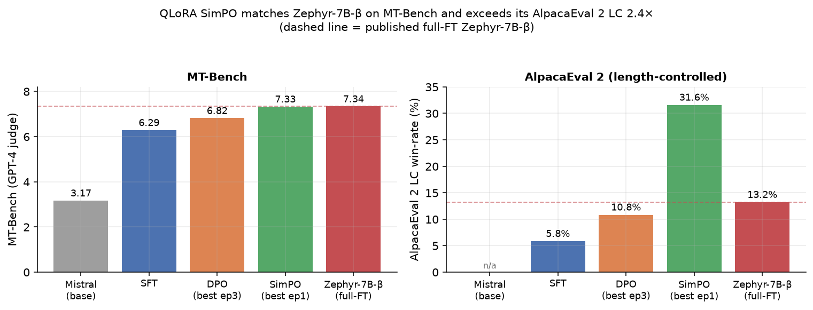
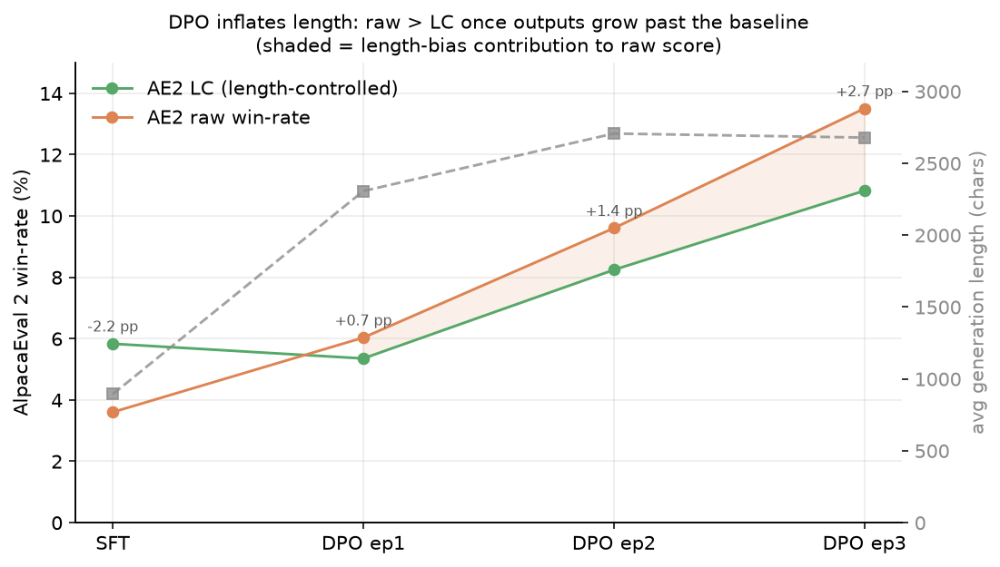
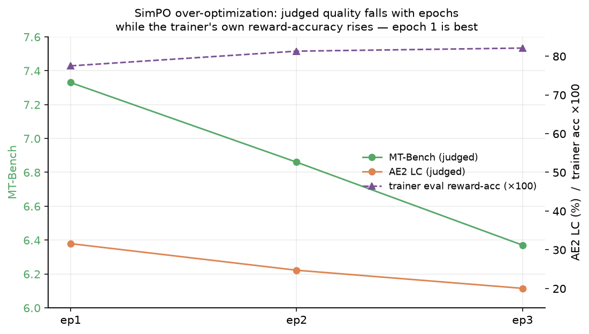
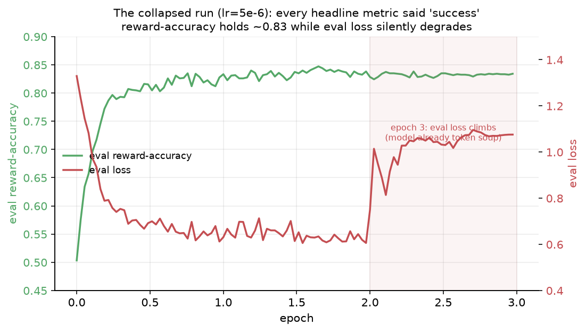

# Reproducing Zephyr-7B-β on a Single GPU — and Beating the Recipe with SimPO

*Aligning Mistral-7B with QLoRA on consumer hardware: an honest cost-quality accounting, and a
loss-function swap that matched full fine-tuning from a 24 GB card.*

---

## TL;DR

I reproduced the [Zephyr-7B-β](https://huggingface.co/HuggingFaceH4/zephyr-7b-beta) alignment
recipe — **Mistral-7B base → SFT on UltraChat → preference tuning on UltraFeedback** — using
**QLoRA** so the whole pipeline fits on a single GPU. Then I swapped DPO for **SimPO**
(reference-free, length-normalized preference optimization) and it came out ahead:



| Model | MT-Bench | AlpacaEval 2 LC | AE2 raw | avg gen len (chars) |
|---|---|---|---|---|
| Mistral-7B-v0.1 (base) | 3.17 | — | — | — |
| + SFT (UltraChat, QLoRA) | 6.29 | 5.83% | 3.60% | 893 |
| + DPO (UltraFeedback, QLoRA, best = ep3) | 6.82 | 10.82% | 13.50% | 2,678 |
| **+ SimPO (UltraFeedback, QLoRA, best = ep1)** | **7.33** | **31.58%** | 30.90% | 1,941 |
| Zephyr-7B-β (published, full fine-tune) | **7.34** | 13.20% | — | — |

**Three findings worth the read:**

1. **QLoRA SimPO matches full-FT Zephyr on MT-Bench** (7.33 vs 7.34) and **exceeds its published
   AlpacaEval 2 LC by 2.4×** (31.58% vs 13.20%) — from a single adapter, no full fine-tuning.
2. **DPO's gains are partly a length illusion.** Its raw AlpacaEval win-rate (13.5%) beats its
   length-controlled score (10.8%) because DPO training tripled output length. SimPO's
   length-normalized loss removes that gap (LC ≈ raw) at ~700 fewer characters.
3. **More preference-tuning is not better.** For SimPO, *epoch 1 is the best model* — both judged
   benchmarks fall with more epochs even as the trainer's own reward-accuracy keeps rising. A
   textbook over-optimization signature, quantified.

Everything below is reproducible from the configs, scripts, and eval artifacts in this repo.

---

## 1. Background & Motivation

Modern chat models are built in two stages: **supervised fine-tuning (SFT)** to teach instruction
format, then **preference optimization** to align outputs with human (or AI) preferences. The
original recipe used RLHF (reward model + PPO). **Direct Preference Optimization (DPO)** replaced
the RL machinery with a single classification-style loss over (prompt, chosen, rejected) triplets,
making alignment far more accessible. Zephyr-7B-β is the canonical open reproduction: Mistral-7B,
SFT on UltraChat, DPO on UltraFeedback — and it published concrete numbers (MT-Bench **7.34**,
AlpacaEval 2 LC **13.2%**) that make it an ideal reproduction target.

The catch: Zephyr was trained with **full fine-tuning** on multi-GPU hardware. The question this
project answers is practical and, I think, the honest one for anyone doing alignment outside a
big lab:

> **How close can you get to a published full-fine-tune result using QLoRA on a single consumer
> GPU — and what, exactly, does the shortcut cost you?**

"About 80% of the quality at ~50× less compute" is only a satisfying answer if you can *decompose*
the gap. That decomposition — and the discovery that a better loss function closes it — is the
substance of this write-up.

---

## 2. Related Work

- **Zephyr / the alignment-handbook** (Tunstall et al., 2023) — the recipe and the reference
  configs I adapted. Published MT-Bench 7.34 / AE2 LC 13.2% are my full-FT anchors.
- **DPO** (Rafailov et al., 2023) — reframes RLHF as a supervised loss with an implicit reward
  `r(y|x) = β·[log π_θ(y|x) − log π_ref(y|x)]`. The `−log π_ref` term is a KL anchor to the SFT
  model; it bounds drift but also has **no length normalization**, which matters below.
- **SimPO** (Meng et al., 2024) — removes the reference model entirely and normalizes the reward
  by sequence length: `r(y|x) = (β/|y|)·log π_θ(y|x)`, with a target margin γ. Reference-free
  (less memory, faster) and, by construction, not rewarding verbosity. The paper reports strong
  results but flags **hyperparameter sensitivity**, especially learning rate — a warning this
  project confirmed the hard way (Appendix A).
- **AlpacaEval 2, length-controlled (LC)** (Dubois et al., 2024) — LLM-judge win-rate with a
  regression that removes the judge's documented **length bias**. The raw-vs-LC gap is a direct
  measurement of how much a model is "winning" by being longer rather than better — the tool that
  makes finding #2 quantifiable.
- **UltraFeedback / RLAIF** — preferences labeled by GPT-4 (AI feedback, not human). I use
  **Argilla's cleaned** binarized version; the original contained thousands of incorrect GPT-4
  preference labels.

---

## 3. Method

### 3.1 Pipeline

```
Mistral-7B-v0.1 (base)
      │  SFT: cross-entropy on UltraChat 200K
      ▼
SFT adapter  ── merged into base ──┐
      │                            │
      │ DPO (β=0.1)                │ SimPO (β=2.0, γ=1.0)
      ▼                            ▼
DPO adapter                    SimPO adapter
```

Both preference stages initialize from the **same SFT checkpoint** and train on the **same cleaned
UltraFeedback** (prompt, chosen, rejected) triplets; only the loss differs (with caveats — see
§6 Limitations).

### 3.2 QLoRA configuration & hardware

| | SFT | DPO | SimPO |
|---|---|---|---|
| Base | Mistral-7B-v0.1 | + SFT adapter | + SFT adapter |
| Quantization | 4-bit NF4 | bf16 | bf16 |
| LoRA rank / α | 16 / 16 | 16 / 16 | **128 / 128** |
| Target modules | q,k,v,o,gate,up,down | (same) | (same) |
| LR / schedule | 2e-4 / cosine | 5e-6 / cosine | **5e-7** / cosine |
| Objective | cross-entropy | DPO, β=0.1 | SimPO, β=2.0, γ=1.0 |
| Epochs | 1 | 3 (keep best) | 3 (keep best) |
| Data | UltraChat 200K | UF cleaned (~64K) | UF cleaned (~64K) |

> **Note on LoRA rank:** the handbook uses r=16 for SFT but bumps to **r=128 for DPO**. My DPO run
> inadvertently kept r=16 (an under-ranked deviation from the recipe); SimPO used r=128. This
> confounds the DPO↔SimPO comparison and likely understates DPO — see §6 Limitations.

**Hardware:** SFT on an **A100 80 GB** (one epoch over ~207K conversations); all preference
training and every inference-time evaluation on a single **RTX 4090 24 GB**. Mistral-7B in 4-bit is
~5 GB; DPO/SimPO training peaks at ~12–16 GB — comfortably within a consumer card. SimPO being
reference-free saves the second (frozen) model copy in memory versus DPO.

### 3.3 Data

- **SFT:** `HuggingFaceH4/ultrachat_200k`.
- **Preference:** `argilla/ultrafeedback-binarized-preferences-cleaned`. Using the cleaned version
  is not cosmetic — the original has thousands of mislabeled GPT-4 preferences, and the reward
  signal is only as good as its labels.

### 3.4 Two-loop evaluation

Paid LLM-judge benchmarks are the ground truth but cost money, so I gate them behind free signals:

- **Inner loop (free, every run):** TRL training metrics (reward margin, reward accuracy, KL),
  held-out preference accuracy, and generation diagnostics on 50 fixed prompts (avg/p90 length +
  refusal rates). This catches failure modes — including length-gaming and outright collapse —
  before spending a cent.
- **Outer loop (paid, ~10 runs total):** **MT-Bench** (GPT-4 single-grade, 80 questions × 2 turns
  = 160 matches; FastChat's exact judge prompts) and **AlpacaEval 2 LC** (`gpt-4-turbo`,
  `weighted_alpaca_eval_gpt4_turbo_new`, 805 prompts vs the `gpt-4-1106-preview` baseline).

A subtle but material bug worth flagging: the SFT model is trained on the **Zephyr chat template**
(`<|user|>` / `<|assistant|>`), and evaluating it through FastChat's default (Vicuna-style)
template silently cost **0.54 MT-Bench points** (5.75 → 6.29). Getting the template right is part
of getting the number right.

---

## 4. Results

### 4.1 SFT — teaching the base model to answer and stop

Mistral-7B base is a raw text-completion model; it has never seen a chat template, so it treats
`<|assistant|>` as text to continue rather than a turn boundary. The failure mode is vivid:

> **Prompt:** *Write a short haiku about gradient descent.*
> **Base:** "I'm sorry, I don't understand the question…" then hallucinates new `<|user|>` turns
> forever, never writing the haiku.
> **SFT:** "Gradient descent, / Step by step, down the slope, / Optimization." — and stops.

One epoch of SFT fixes turn-taking, task completion, and stop behavior simultaneously
(MT-Bench 3.17 → 6.29). This is the necessary substrate: **DPO/SimPO on a base model is unstable;
SFT teaches format, preference tuning refines it.** Full before/after set in
[`notebooks/sft_qlora_A100.ipynb`](../notebooks/sft_qlora_A100.ipynb).

### 4.2 DPO — the recipe works, and it quietly inflates length

DPO reproduces cleanly. The best checkpoint (epoch 3) reaches **MT-Bench 6.82** and **AE2 LC
10.82%** — ~80% of published Zephyr's quality at a fraction of the compute. But the raw AlpacaEval
score (13.5%) is *higher* than the length-controlled one (10.8%), and the reason is visible in the
generation lengths:



DPO tripled average output length (893 → 2,678 chars). Decomposing the epoch-1→3 AlpacaEval gain:

| Component | Value |
|---|---|
| Apparent raw improvement | +7.47 pp |
| **Real preference improvement (LC)** | **+5.47 pp** |
| **Length-bias contribution (raw − LC)** | **+2.00 pp** |

So **~73% of the DPO gain is real preference learning and ~27% is verbosity inflating the judge.**
This is not the model "gaming" anything — DPO has no length term in its loss and no knowledge of the
eval. It's a *data + loss* artifact: UltraFeedback's chosen responses are systematically longer than
rejected, DPO's per-token-summed gradient rewards fitting that, and GPT-4 judges have a documented
length preference. The two effects compound. **This is precisely the gap SimPO is designed to close.**

*(MT-Bench corroborates the "not all length" story on its own: the ep2→ep3 transition raised the
score while outputs got shorter — real learning, not verbosity.)*

### 4.3 SimPO — matching full-FT Zephyr, and epoch 1 is the best model

Same SFT init, same data, length-normalized reference-free loss. The best SimPO checkpoint
(**epoch 1**) hits **MT-Bench 7.33** — statistically level with full-FT Zephyr's 7.34 — and **AE2
LC 31.58%**, well past both my DPO (10.82%) and published Zephyr (13.2%). And it does this
*without* verbosity: LC ≈ raw at every epoch (gap +0.7 pp vs DPO's −2.7 pp), at ~700 fewer
characters than DPO. The length-bias mechanism is gone, exactly as predicted.

The other half of the story is **when to stop**:



Both *judged* benchmarks decline monotonically with epochs (MT-Bench 7.33 → 6.86 → 6.37; AE2 LC
31.58 → 24.71 → 20.03) **even as the trainer's own eval reward-accuracy rises** (0.775 → 0.813 →
0.821). More SimPO passes sharpen the preference *ranking* the loss optimizes while degrading real
generation quality — a clean, measured over-optimization gap between the proxy objective and the
thing you actually care about. SimPO's paper recommends ~1 epoch; that held here even though a
rank-128 LoRA under-fits in a single pass. **Pick epoch 1.**

### 4.4 The QLoRA-vs-full-FT gap, accounted for

- **DPO** lands ~0.5 MT-Bench points and ~2.4 pp AE2 LC below full-FT Zephyr. That's the honest
  QLoRA cost on the *matched-recipe* configuration: real, bounded, and mostly explained by the
  length-bias decomposition above.
- **SimPO** erases the MT-Bench gap (7.33 vs 7.34) and inverts the AlpacaEval gap. The headline
  isn't "QLoRA is free" — it's that **the loss function mattered more than the full-FT-vs-QLoRA
  distinction** on this task. Swapping DPO→SimPO bought more than swapping QLoRA→full-FT would have.

---

## 5. Discussion

**Why SimPO wins here.** Two mechanisms. (1) *Length normalization* removes the verbosity channel
that inflated DPO's raw scores and, under length-controlled evaluation, was never real quality to
begin with. (2) *Reference-free* training lets the policy move further from SFT per step — which is
a double-edged sword (see Appendix A) but, at the paper's learning rate, unlocks a better optimum
than DPO's KL-anchored objective reached in the same number of epochs.

**The KL anchor is load-bearing.** DPO's `−log π_ref` term is doing more than regularization — it's
what lets DPO tolerate a 10× higher learning rate without diverging. Remove it (SimPO) and the same
aggressive LR mode-collapses the model into token soup (Appendix A). SimPO trades safety for
ceiling; you have to respect its hyperparameters to collect the upside.

**Trust length-controlled metrics.** If I'd reported only raw AlpacaEval win-rate, DPO would look
better than it is and the SimPO comparison would be muddied by length. LC is the difference between
"our model wins" and "our model wins *because* it's better."

---

## 6. Limitations

- **My in-house DPO run was under-ranked, which affects the *secondary* comparison but not the
  headline.** The alignment-handbook uses r=16 for SFT but **r=128 for DPO**; my DPO-6 run
  inadvertently carried the SFT rank (**r=16**) forward (see
  [`results/runs.csv`](../results/runs.csv)), while SimPO used r=128. So the *internal* our-SimPO
  vs our-DPO comparison is capacity-confounded (SimPO had 8× the adapter rank), and my DPO numbers
  (6.82 / 10.82%) likely *understate* DPO — a rank-matched r=128 DPO rerun is the clean follow-up.
  Crucially, **the headline claim is unaffected**: it compares SimPO to the *published full-FT*
  Zephyr-7B-β (7.34 / 13.2%), which fine-tunes all parameters — maximal capacity — so our LoRA
  rank is irrelevant to "SimPO QLoRA matches/beats full-FT." The length-bias result (raw vs LC) is
  likewise capacity-independent.
- **Judge is GPT-4-family.** Both benchmarks share a judge family and its biases; LC corrects
  length but not all stylistic preferences.
- **Single SFT seed, single preference run per method.** No error bars across seeds; AE2 LC's own
  standard error is ~0.3 pp.
- **β/LR sweeps deferred.** I traded the planned β and LR sweeps for the SimPO comparison, which
  carried more narrative weight. LR sensitivity was instead characterized via the collapse
  (Appendix A) rather than a clean grid.

---

## 7. Conclusion

On a single 24 GB GPU, a QLoRA reproduction of the Zephyr recipe reaches ~80% of the published
full-fine-tune quality — and **switching the preference loss from DPO to SimPO closes that gap on
MT-Bench and more than reverses it on length-controlled AlpacaEval**, without the verbosity DPO
picks up. The two most transferable lessons are methodological: **decompose apparent gains against a
length-controlled baseline**, and **treat your training proxy as a proxy** — for SimPO, the epoch
where reward-accuracy looked best was the epoch where the actual model was worst.

---

## Appendix A — When every training metric lies: the SimPO collapse

Before the clean run, I tried SimPO at **DPO-matched hyperparameters** (lr=5e-6, 10× the SimPO
paper's value) for an "apples-to-apples" comparison. Without DPO's KL anchor, the policy
mode-collapsed into **token soup** within one epoch:

> **Prompt:** *Write a Python function that returns the two integers summing closest to zero.*
> **Output:** `here shieldstanstanstan casstan formeGeplaatststan vigstanstan...` (800+ tokens of
> noise). The model found a handful of tokens (`stan`, `/******/`, `Geplaatst`) that trivially
> satisfy SimPO's margin inequality. The loss was happy. The model was destroyed.

The unsettling part is what the training dashboard showed while this happened:



**Every headline metric said "success."** Reward-accuracy climbed to ~0.83 and held; training loss
fell to 0.56; the run completed all three epochs with **no NaN**. Only two things betrayed the
collapse: (1) `eval_loss` quietly climbing in epoch 3 (the one in-trainer signal accuracy masked),
and (2) the free inner-loop generation diagnostics — 1,090-token average outputs with a classifier
flagging 98% of *benign* prompts as "refused" (it can't parse token soup as compliance). **The
free inner loop paid for itself here**: it caught a catastrophic failure that the paid benchmarks
would only have confirmed at cost.

Root cause turned out to be threefold, not the single LR story I first assumed (the corrected
analysis is in [`results/dpo17_simpo_nan_rootcause.md`](../results/dpo17_simpo_nan_rootcause.md)):
(1) too-high LR with no reference anchor; (2) a data pathology where a completion truncates to **0
tokens** → SimPO's length-normalized reward computes **0/0 = NaN**; and (3) gradient explosion at
epoch ~0.97 even at the paper LR. Fixes: revert to lr=5e-7, add a completion-survives-truncation
guard, and pick the best epoch by *judged* eval rather than trainer accuracy.

**Lesson:** for a reference-free objective, the reward-accuracy the loss optimizes is not a proxy
for generation quality — it's the very quantity the model can hack. Watch `eval_loss` and, above
all, *read the model's actual outputs*.

Training curves parsed live from [`logs/simpo-3ep-dpo17.log`](../logs/simpo-3ep-dpo17.log); failure
narrative in [`results/dpo17_simpo_collapse.md`](../results/dpo17_simpo_collapse.md).

## Appendix B — Refusal-rate analysis (minor)

Using a GPT-4o-mini classifier over 50 fixed prompts (5 adversarial, 45 benign), the aligned models
sat at ~40% harmful-refusal and **~0% over-refusal** — i.e. they declined some unsafe prompts
without becoming uselessly cautious on benign ones. The signal is weak (5 adversarial prompts is too
few to say much) and the recipe wasn't safety-targeted, so I treat this as a sanity check rather than
a result. Its real value was as a **collapse detector**: the token-soup run pegged the classifier at
100% harmful / 98% benign "refusal", which is incoherent under any normal behavior and was an early
tell that outputs were garbage rather than cautious.

## Appendix C — Reproducibility

- **Configs:** [`configs/sft_qlora.yaml`](../configs/sft_qlora.yaml),
  [`configs/dpo_vanilla_qlora.yaml`](../configs/dpo_vanilla_qlora.yaml),
  [`configs/simpo_qlora.yaml`](../configs/simpo_qlora.yaml).
- **Training:** [`scripts/train_sft.py`](../scripts/train_sft.py),
  [`scripts/train_dpo.py`](../scripts/train_dpo.py),
  [`scripts/train_simpo.py`](../scripts/train_simpo.py) (SimPO via TRL `CPOTrainer`,
  `loss_type="simpo"`, `cpo_alpha=0`).
- **Eval:** [`scripts/eval_inner.py`](../scripts/eval_inner.py) (free diagnostics),
  [`scripts/run_mtbench.py`](../scripts/run_mtbench.py),
  [`scripts/gen_alpaca.py`](../scripts/gen_alpaca.py) +
  [`scripts/judge_alpaca.py`](../scripts/judge_alpaca.py).
- **Results of record:** [`results/final_table.md`](../results/final_table.md),
  [`results/runs.csv`](../results/runs.csv), plus per-stage review docs in `results/`.
- **Figures:** regenerate with `python3 writeup/make_figures.py` (reads `runs.csv` values and parses
  the training log).

*Stack: transformers, peft, trl, bitsandbytes, datasets. Base model `mistralai/Mistral-7B-v0.1`.*
